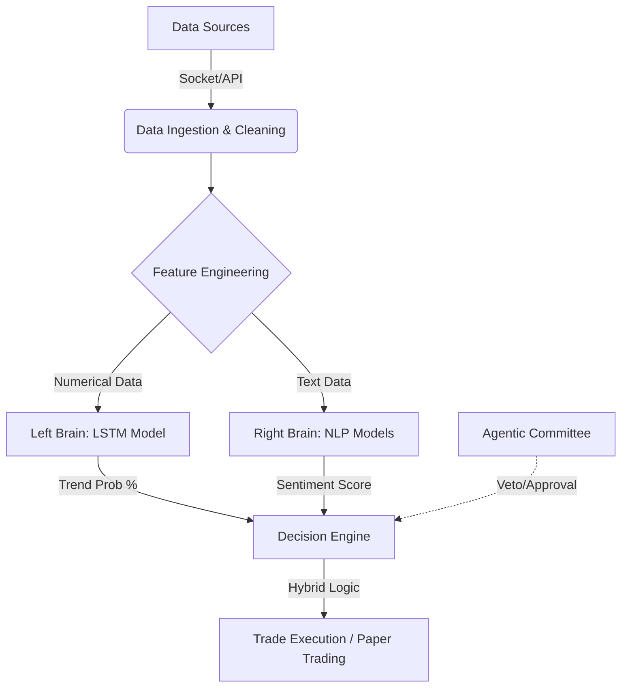

# BIST AI System: Hybrid Algorithmic Trading Bot

**BIST AI System** is an autonomous, hybrid algorithmic trading platform designed for the **Borsa Istanbul (BIST)**. It fuses **Quantitative Analysis** (Deep Learning via LSTM) with **Qualitative Analysis** (NLP via BERT/T5) to make high-probability trading decisions.

Unlike traditional bots that rely solely on technical indicators, BIST AI simulates a human investment committee by analyzing price action, technical indicators, and breaking news sentiment simultaneously.

---

## 🏗 System Architecture

The system operates on a pipeline architecture similar to a manufacturing plant: **Raw Data Ingestion > Feature Engineering > Dual-Brain Analysis > Decision Execution.**



### Core Components

1. **The Eyes (Data Collection):** Fetches real-time tick data and news.
2. **The Nervous System (Socket Server):** Transmits low-latency data via TCP/IP.
3. **The Memory (Database):** SQLite storage for historical ticks and transaction logs.
4. **The Brain (AI Models):**
* **Quantitative:** LSTM for price prediction.
* **Qualitative:** BERT for sentiment analysis & mT5 for summarization.


5. **The Decision Center:** A rule-based bot or an AI Investment Committee (LangGraph).

---

## 🚀 Key Features

* **Hybrid Data Source:** Supports both **Free Mode** (Yahoo Finance `yfinance` wrapper) and **Pro Mode** (Matriks IQ via Custom C# `.dll` Bridge).
* **Deep Learning Prediction:** Uses **LSTM (Long Short-Term Memory)** networks trained on 60-minute lookback windows to predict price direction probabilities.
* **Advanced NLP Engine:**
* **Sentiment Analysis:** `savasy/bert-base-turkish-sentiment-cased` scores news from -1 (Negative) to +1 (Positive).
* **Summarization:** `ozcangundes/mt5-small-turkish-news-summarization` converts complex financial news into 2-sentence summaries.


* **Paper Trading Simulator:** Built-in simulation with a virtual 100,000 TL portfolio and realistic commission rates (0.2%).
* **Live Dashboard:** A real-time **Streamlit** interface displaying technical charts, AI confidence gauges, and news feeds.
* **Agentic Investment Committee (Beta):** A multi-agent system using **LangGraph** where specialized AI agents (Risk Manager, Technical Analyst, Fundamental Analyst) debate trade decisions.

---

## 🧠 Technical Deep Dive

### 1. Data Pipeline & Feature Engineering

Raw tick data is resampled into **1-minute OHLCV candlesticks**. The system mathematically derives features for the AI to "see" the market:

* **Momentum:** RSI (14)
* **Trend:** SMA (50), EMA (200), MACD
* **Volatility:** Bollinger Bands (20, 2)
* *Note:* The first 200 data points are dropped to ensure mathematical accuracy of moving averages (Lookback Period).

### 2. The AI Models

| Model Type | Architecture | Input | Output | Purpose |
| --- | --- | --- | --- | --- |
| **Price Predictor** | **LSTM** (4 Layers, Dropout 0.2) | Last 60 min (Price + Indicators) | Probability [0.0 - 1.0] | Detect technical patterns (Head & Shoulders, Flags). |
| **Sentiment** | **BERT** (Transformer) | News Text (Scraped) | Score [-1.0 to +1.0] | Quantify the impact of news. |
| **Summarizer** | **mT5** (Seq2Seq) | Long News Article | Short Summary | User readability on dashboard. |

### 3. Hybrid Decision Logic (The "Bot")

The autonomous bot (`run_bot.py`) uses a strict **AND** logic for entry and **OR** logic for exit to minimize risk.

* **BUY Signal:** `(LSTM_Prob > 60%)` **AND** `(News_Sentiment > -0.2)`
* **SELL Signal:** `(LSTM_Prob < 40%)` **OR** `(News_Sentiment < -0.5)`
* **HOLD:** Any state between these thresholds.

---

## 🕵️‍♂️ The Investment Committee (Agentic AI) `[Experimental]`

*Current Status: Beta / In Development*

Moving beyond simple IF/ELSE logic, this project implements an **Agentic AI** system using **LangGraph**. It mimics a real-world hedge fund meeting.

**The Agents:**

1. **🕵️‍♂️ Technical Analyst:** Uses `iTransformer` models to analyze charts.
2. **📰 Fundamental Analyst:** Analyzes macroeconomic data and company news.
3. **⚖️ Risk Manager (The Gatekeeper):** Calculates **VaR (Value at Risk)**. Has **Veto power** over all trades.
4. **👔 Head Trader:** Aggregates all reports and executes the final decision.

**Workflow:**

> *Technical says "BUY" -> Fundamental says "SELL (Oil prices up)" -> Risk says "Neutral" -> Head Trader decides "HOLD".*

---

## 🛠 Installation & Setup

### Prerequisites

* Python 3.10+
* Git

### 1. Clone the Repository

```bash
git clone https://github.com/yourusername/bist-ai-system.git
cd bist-ai-system
pip install -r requirements.txt

```

### 2. Run the Modules

The system requires 4 separate terminal processes to run fully:

**Terminal 1: Data Server (TCP Socket)**

```bash
python integration/matriks_bridge/socket_server.py

```

**Terminal 2: Data Feeder (Yahoo Finance Source)**

```bash
python integration/free_data_feeder.py

```

**Terminal 3: The Brain (Trading Bot)**

```bash
python run_bot.py

```

**Terminal 4: User Interface**

```bash
streamlit run dashboard.py

```

---

## 📊 Dashboard Overview

The **Streamlit** dashboard is the command center:

* **Gauge Chart:** Shows the AI's "Bullishness" (Green > 52%, Pink < 50%).
* **Technical Charts:** Live plotting of Price, SMA50, EMA200, and Bollinger Bands.
* **Smart News Feed:** Lists relevant news with color-coded sentiment tags and AI-generated summaries.
* **Cache Control:** Button to clear news cache manually.

---

## 📂 Project Structure

```text
bist-ai-system/
├── agents/                 # LangGraph Agent Definitions
│   ├── technical_agent.py
│   ├── risk_agent.py
│   └── head_trader.py
├── core/                   # Core Logic
│   ├── feature_engine.py   # Indicator calculations
│   ├── news_agent.py       # BERT & mT5 implementation
│   └── trader.py           # Paper trading execution
├── data/                   # Database & Logs
│   ├── bist_data.db        # SQLite Storage
│   └── trade_log.csv       # Transaction history
├── integration/            # Data Sources
│   ├── matriks_bridge/     # C# DLL & Socket Server
│   └── free_data_feeder.py # Yahoo Finance wrapper
├── models/                 # Saved AI Models
│   └── lstm_price/
├── dashboard.py            # Streamlit UI
├── run_bot.py              # Main Autonomous Loop
└── run_committee.py        # Agentic AI Simulation

```

---

## ⚠️ Disclaimer

*This software is for **educational and research purposes only**. It acts as a simulation (Paper Trading). The developers accept no responsibility for any financial losses incurred if the code is modified for real-money trading. Cryptocurrency and Stock Market investments carry high risks.*

---

**License:** MIT

**Author:** Hamza Yuksel

**Version:** 1.0.0
